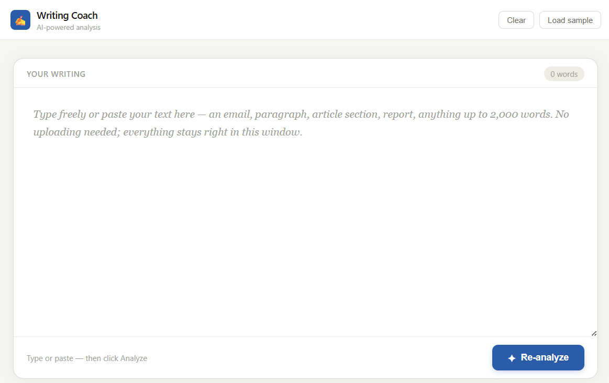
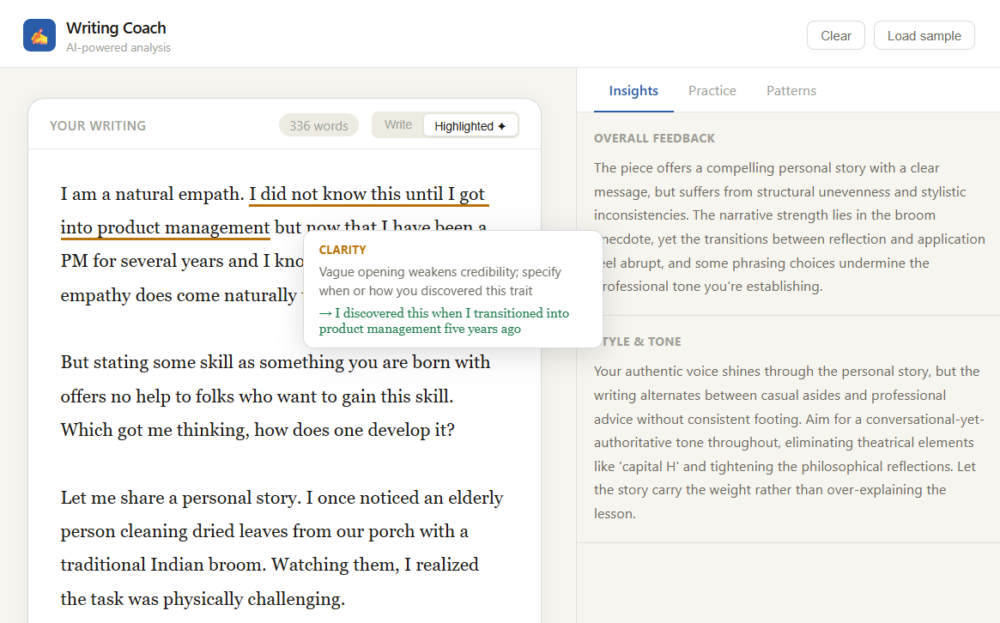
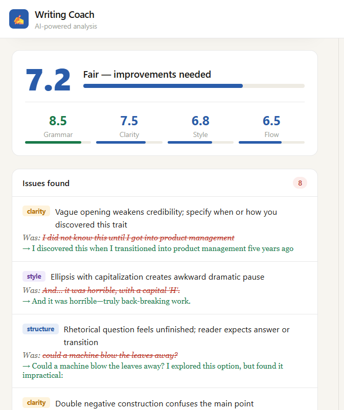
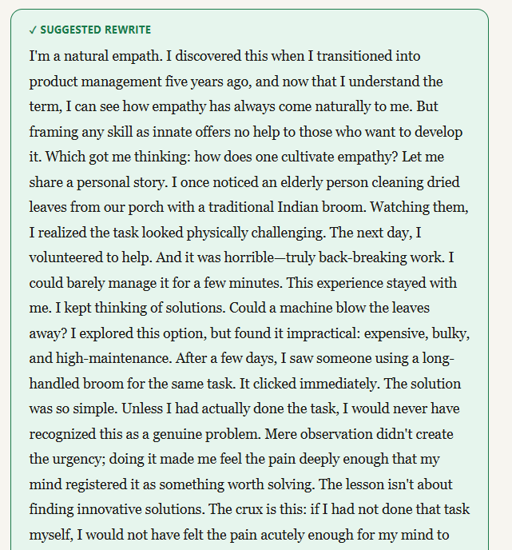
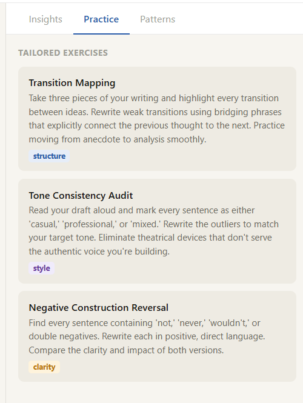

[README.md](https://github.com/user-attachments/files/26040552/README.md)
# ✍ Writing Coach

An AI-powered writing analysis tool built on Claude. Paste any text — an email, paragraph, report section, or article up to 2,000 words — and get instant feedback on grammar, clarity, style, and flow, with inline highlights, a corrected rewrite, and tailored practice exercises.

---

## Screenshots

**Writing canvas — type or paste your text**

**Inline highlights — hover any underline to see the issue and fix**

**Score card and Issues — overall rating with Grammar, Clarity, Style and Flow breakdown**

**Suggested rewrite — full clean version of your text**

**Practice exercises — tailored to your weakest areas**

---

## Features

- **Big writing canvas** — type or paste directly, no file uploads needed
- **Inline highlights** — every issue underlined in your text by category (grammar, punctuation, clarity, style, structure), with hover tooltips showing the fix
- **Writing score** — overall 0–10 rating plus individual scores for Grammar, Clarity, Style, and Flow
- **Issues list** — each problem explained with the original phrase and a corrected version
- **Suggested rewrite** — a full clean version of your text with all issues resolved
- **Insights panel** — narrative feedback on your writing and style/tone advice
- **Practice exercises** — 3 exercises generated specifically for your weakest areas
- **Patterns tracker** — recurring mistake types surface across multiple analyses
- **Score history** — track improvement over a session

---

## Getting Started

### 1. Get an Anthropic API key

Sign up at [console.anthropic.com](https://console.anthropic.com) and create an API key. It will look like `sk-ant-api03-...`.

New accounts include free credits. Each analysis costs approximately **$0.005–0.01** depending on text length (using Claude Haiku).

### 2. Deploy to GitHub Pages

1. Fork or clone this repository
2. Make sure the main file is named `index.html`
3. Go to **Settings → Pages** in your repo
4. Set Source to **Deploy from a branch → main → / (root)**
5. Wait ~1 minute — your app will be live at `https://yourusername.github.io/writing-coach`

### 3. Use the app

When you open the app, you'll be prompted to enter your API key. It is:
- Stored only in your **browser session** (`sessionStorage`)
- **Never sent to any server** — only to `api.anthropic.com` directly
- **Cleared automatically** when you close the tab

You can change or update your key at any time using the key badge in the top-right corner.

---

## Usage

1. Type or paste your text into the writing canvas (up to 2,000 words)
2. Click **Analyze**
3. The app switches to **Highlighted** view — hover over any underlined phrase to see the issue and suggested fix
4. Toggle between **Write** and **Highlighted** views at any time
5. Scroll down to see your score card, full issues list, and suggested rewrite
6. Check the **Insights** tab on the right for narrative feedback
7. Check **Practice** for tailored exercises
8. Run multiple analyses to build up your **Patterns** history

---

## Technology

| Component | Details |
|---|---|
| Frontend | Vanilla HTML, CSS, JavaScript — single file, no build step |
| AI model | Claude Haiku via Anthropic API |
| Hosting | GitHub Pages (static) |
| Data storage | None — everything runs in the browser |

No backend, no database, no server costs. Just a static HTML file calling the Anthropic API directly from the browser.

---

## Cost Estimate

| Usage | Approx. monthly API cost |
|---|---|
| Personal use (10–20 analyses/day) | < $1 |
| Small team (100 analyses/day) | ~$3–5 |
| Public tool (1,000 analyses/day) | ~$30–50 |

---

## Customisation

The entire app is a single `index.html` file — easy to modify:

- **Change the model** — find `claude-haiku-4-5-20251001` in the JS and swap it for `claude-sonnet-4-6` for higher quality (costs more)
- **Adjust the prompt** — the analysis prompt is clearly marked in the `analyze()` function; edit the JSON schema to add or remove scoring dimensions
- **Restyle** — all colours are CSS variables at the top of the `<style>` block

---

## Privacy

- Your text is sent directly from your browser to Anthropic's API for analysis
- Nothing is stored on any server
- Your API key lives only in your browser's `sessionStorage` for the duration of your tab session
- Review [Anthropic's privacy policy](https://www.anthropic.com/privacy) for details on how API inputs are handled

---

## License

MIT — free to use, modify, and distribute.

---

## Acknowledgements

Built with [Claude](https://anthropic.com) by Anthropic.
